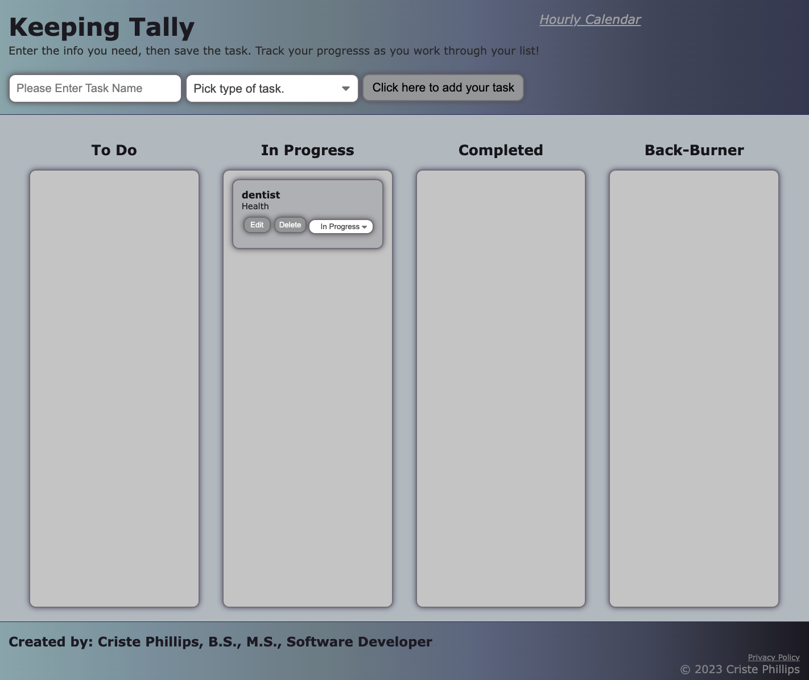

# keeping-tally

## Purpose
A website application designed to help users keep track of busy lives and tasks.

## Description
When user enters a 'task name', selects a 'task type' and adds that task to the list, then that specific task is placed into the initial list of 'Tasks to Do'.  Alternatively, 'task type' field is intuitive with the first letter (for individual selections, user must still scroll for multiple options that begin with the same letter), pressing ENTER after toggling choice will add the list item to the 'To Do' column.

When user selects 'Click here to add your task' without entering information into the 2 fields (task name and task type), a drop down reminder populates, telling the user that they must fill out the task form.  To clear this, user must click 'ok'

When user mouses over the 'edit' button, the font color changes to indicate that the user is on that specific button.  When user selects 'edit' of a given task found under 'To Do', 'In Progress', 'Completed', or 'Back-Burner', the user is able to edit the 'task name' and or the 'task type'.  During the edit phase of the task, interactive button for user has changed from 'add task' to 'save task'.  

When user selects 'save task' after editing an item, the new item is saved in the current column that the task was assigned to. 

When user mouses over the 'delete' button, the font color changes to indicate that the user is on that specific buttonWhen user selects 'delete' of a given task found under 'To Do', 'In Progress', 'Completed', or 'Back-Burner', the user is able to delete that task item from the list.

When user toggles the drop down menu within the saved list item, user is presented with options to select 'To Do', 'In Progress', 'Completed', or 'Back Burner'.  By Selecting an alternative to the currently selected option, the list item is shifted to the newly designated column.

## Built With
* HTML
* CSS
* JavaScript
* Bootstrap
* Jquery
* Cloudflare
* Moment.js

## Website
https://github.com/cphill11/keeping-tally.git

## Image: 

## Contribution
Criste Phillips.  Sticky paws off unless permitted by creator.